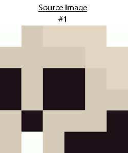

# Depixelization

This is an implementation of *Depixelizing Pixel Art* by Johannes Kopf and Dani Lischinski, and is not their real-time solution that's described in their latest paper. What their algorithm does is take pixel-art and converts it into resolution-independent vector art.

<div align="center">
 
</div>

The algorithm they came up with creates an 8-connected lattice graph (a similarity graph) based on the pixels in the source image, and procedurally disconnects them based on how similar they are, and on edge weights generated by a few heuristics.

Once the similarity graph has all of its crossing edges resolved, it's converted into a voronoi graph, which creates cells around each of the pixels. Contours are created in two varieties: visible and shading. Visible contours separate regions of significantly different color, and are typically solid lines. Shading contours are filled color regions. The algorithm calls to fit quadratic b-splines to all visible contours, with some optimizations of control points to fix visual artifacts.

Lastly, the image is rendered as vector art using "standard techniques". My plans are to generate LaTeX files that, once rendered, will draw the different contours produced during earlier parts of the algorithm.

You can find the paper my implementation is based on [here](https://johanneskopf.de/publications/pixelart/).

## Build Instructions

The project is configured in CMake, and thus requires CMake to generate the project files. You can download it from [here](https://cmake.org/download/). A version of CMake >= **3.11** is required.

To generate a project, execute the following from with in the root directory of the repository:

```bash
mkdir build && cd build
cmake ..
```

Depending on your operating system and installed IDE's, a build system will be generated in the build folder. If a specific build system is desired:

```bash
mkdir build && cd build
cmake -G "<Generator>"
```

Where you would swap the desired generator with `<Generator>`, retaining the double quotes. You can view a list of possible generators on your system with `cmake -H`.

To build and link the project, a modern C++ compiler is required, as the project is written in C++17. If CMake can find your compiler's executable, then the following will build the project (from within the build directory):

```bash
cmake --build .
```

An alternative, if you can run Visual Studio, is to generate a solution and build from within that.

### Building Tests

By default, CMake will generate project files for unit tests. This can be changed by setting the option `DEPIXELIZATION_BUILD_TESTS` to `OFF`.

```bash
cmake -DDEPIXELIZATION_BUILD_TESTS=OFF ..
```

The tests are written with google test and can be run using the following command from within the build directory:

```bash
ctest -C <configuration>
```

Where `<configuration>` is whatever configuration of the tests you want to run (Debug, Release, etc). The tests can also be run from within Visual Studio through `Test->Run->Run All Tests`.

### Boost

Boost 1.70 is a dependency of the project, and if on Windows, one may need to point CMake in the right direction to find the location where it was installed.

Set the CMake variable `BOOST_ROOT` to the the root directory of your boost installation:

```bash
cmake -DBOOST_ROOT=<boost root directory> ..
```

This will add `BOOST_ROOT` to the CMakeCache.txt. For successive project generations, CMake will pull from the cached variable and won't require you to explicitly set it from the command line.

## Usage

This is not a complete implementation of the algorithm. At this time, the processing up to the voronoi diagram is complete. Future iterations will address fitting splines and rendering the images with color.

For the time being, the application can be run from the command line to generate `.tex` files for similarity graphs and voronoi diagrams:

```
Usage: depixelization [options] image

Positional arguments:
image                   The input image to depixelize

Optional arguments:
-h --help               show this help message and exit
-o --output             The destination directory to write the output files to[Required]
-sg --similarity_graph  Also output the similarity graph as a .tex file
-vg --voronoi_graph     Also output the voronoi graph as a .tex file
-v --verbose            Display verbose messages
```

These `.tex` files are an intermediate format that can be passed through `pdflatex` to generate PDFs. [Inkscape](https://inkscape.org/) can be used to convert the PDFs into SVGs. Future work will remove the intermediate files and will output SVGs directly.

### Example

To generate a similarity graph of `skull.png`, we would do the following, if called from `build/Release`:

```
./depixelization.exe ../../skull.png -o <some_directory> -sg
```

To generate the voronoi graph, you would do the following:

```
./depixelization.exe ../../skull.png -o <some_directory> -vg
```

You can also combine `-vg` and `-sg` to have the application spit out both the voronoi and similarity graph in one run.
